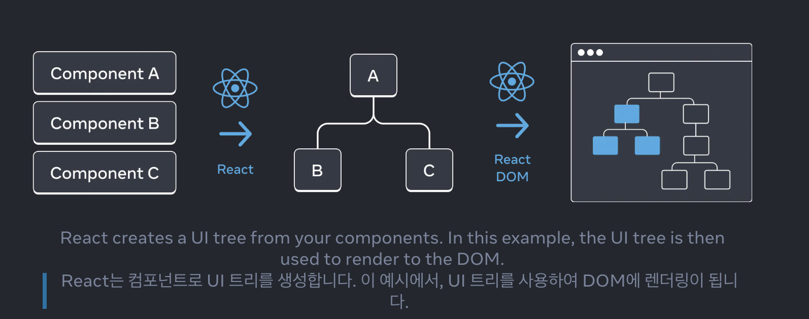

# UI를 트리로 이해하기

React 앱은 많은 컴포넌트들이 서로 중첩된 형태로 구성되어 있습니다. React는 어떻게 앱의 컴포넌트 구조를 추적할까요?

### 트리로 보는 UI

트리는 아이템 간의 관계 모델이며 UI는 트리 구조를 사용하여 표현되는 경우가 많습니다. 예를 들어 브라우저는 트리 구조를 사용하여 HTML(DOM) 및 CSS(CSSOM)를 모델링합니다.

브라우저 및 모바일 플랫폼과 마찬가지로 React 역시 트리 구조를 사용하여 React 앱의 컴포넌트 간의 관계를 관리하고 모델링합니다. 이 트리들은 React 앱을 통해 데이터가 어떻게 흘러가는지, 렌더링 및 앱의 크기를 최적화하는 방법을 이해하는 데 유용한 도구입니다.

### The Render Tree

컴포넌트 주요 특징은 다른 컴포넌트의 컴포넌트를 합성할 수 있다는 것입니다. **컴포넌트를 중첩하면 부모 컴포넌트와 자식 컴포넌트 라는 개념이 생기며**, 각 부모 컴포넌트는 그 자체로 다른 컴포넌트의 자식이 될 수 있습니다.

### Recap

- 트리는 엔터티 간의 관계를 나타내는 일반적인 방법입니다. UI를 모델링하는 데 자주 사용됩니다.

- 렌더 트리는 단일 렌더 전반에 걸쳐 React 컴포넌트 간의 중첩 관계를 나타냅니다.

- 조건부 렌더링을 사용하면 렌더 트리가 여러 렌더링에 걸쳐 변경될 수 있습니다. prop 값이 다르면 컴포넌트가 다른 하위 컴포넌트를 렌더링할 수 있습니다.

- 렌더 트리는 최상위 컴포넌트와 리프 컴포넌트가 무엇인지 식별하는 데 도움이 됩니다. 최상위 컴포넌트는 그 아래에 있는 모든 컴포넌트의 렌더링 성능에 영향을 미치며 리프 컴포넌트는 자주 리렌더링되는 경우가 많습니다. 이를 식별하는 것은 렌더링 성능을 이해하고 디버깅하는 데 유용합니다.
